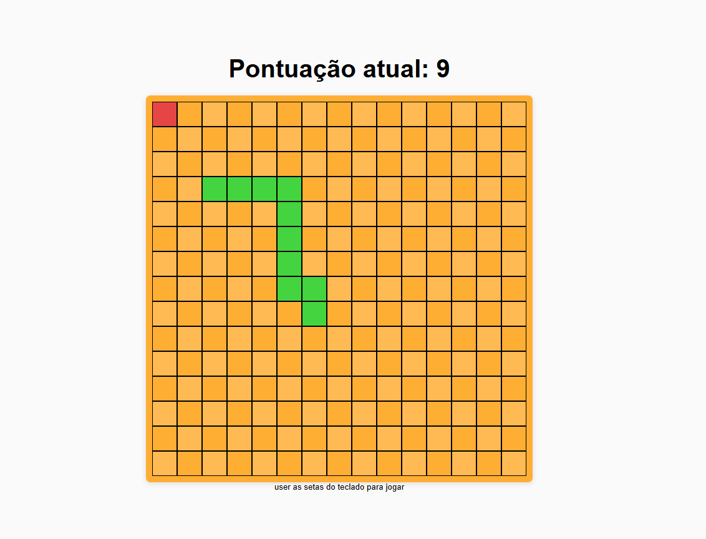

# Snake Game (clássico)

tava me sentindo meio enferrujado com js, ai pensei "sera que conseguiria fazer snake game só com html,css e js sozinho?". com isso em mente estou tentando fazer o jogo (mesmo que não seja da melhor maneira possivel) mas inteiramente por mim, sem usar ia nem nada (com exeção de pesquisar metodos do js ou semelante)

## Primeira imagem de como estava projeto

primeira vez que ele "funcionou" no sentido da cobrinha come e cresce. mas ainda falta coisa...

# Jogo Funcionando

no geral o jogo esta funcionando bem, tem dois (~~bu-~~) features bem legais, clicar mais vezes na direção que você quer acelera a cobrinha, e na direção contraria freia ela totalmente

