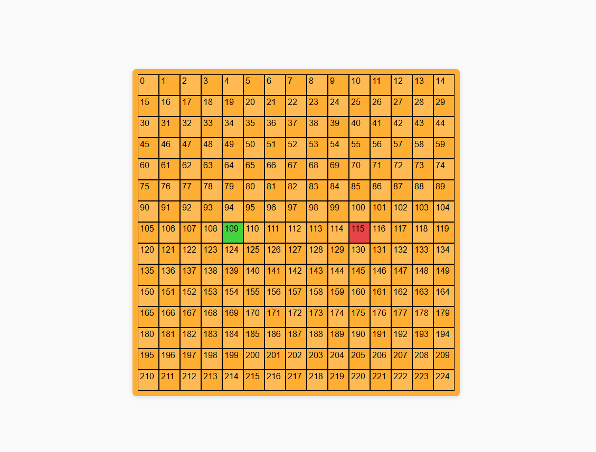

# Snake Game (clássico)

tava me sentindo meio enferrujado com js, ai pensei "sera que conseguiria fazer snake game só com html,css e js sozinho?". com isso em mente estou tentando fazer o jogo (mesmo que não seja da melhor maneira possivel) mas inteiramente por mim, sem usar ia nem nada (com exeção de pesquisar metodos do js ou semelante)

## Imagem de como ta o projeto

primeira vez que ele "funcionou" no sentido da cobrinha come e cresce. mas ainda falta coisa...

