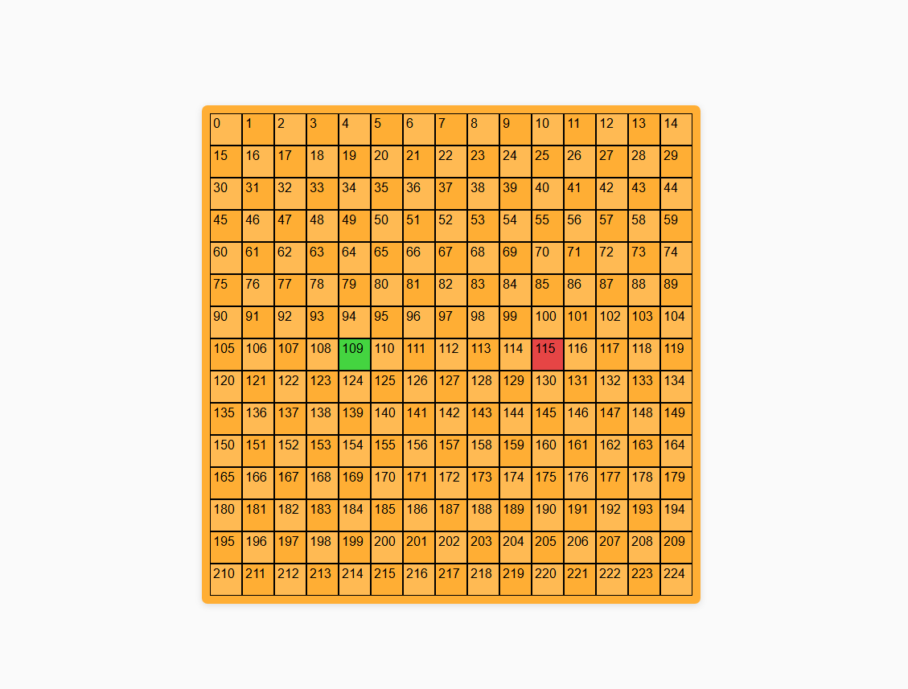
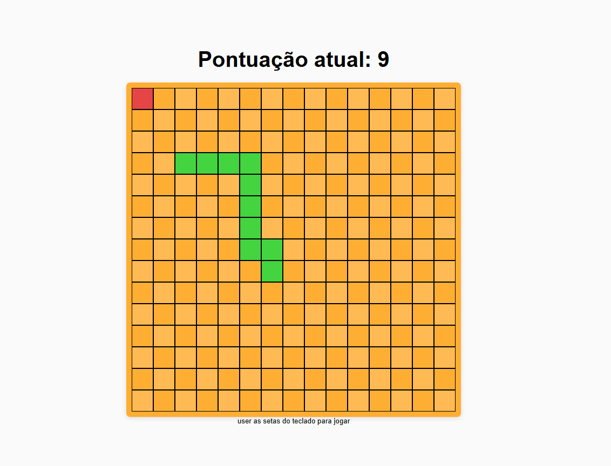
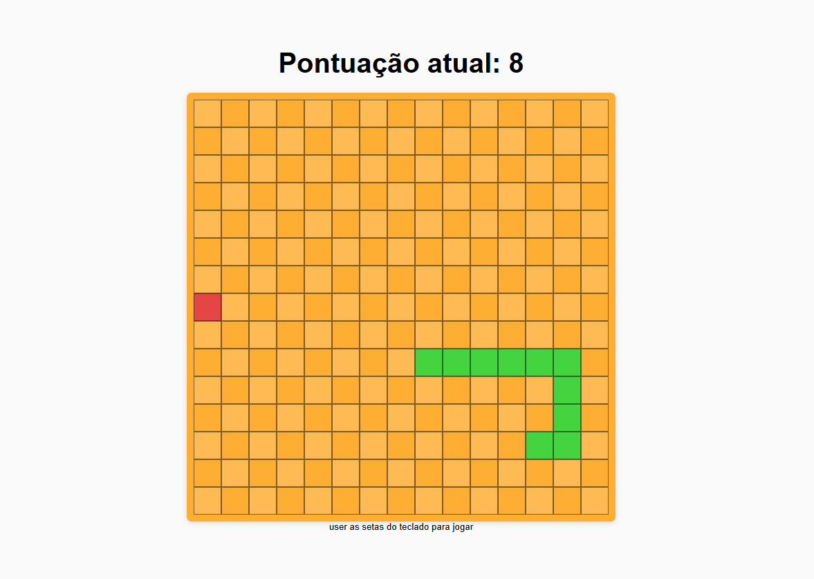

# Snake Game (clássico)

tava me sentindo meio enferrujado com js, ai pensei "sera que conseguiria fazer snake game só com html,css e js sozinho?". com isso em mente estou tentando fazer o jogo (mesmo que não seja da melhor maneira possivel) mas inteiramente por mim, sem usar ia nem nada (com exeção de pesquisar metodos do js ou semelante)

## Primeira imagem de como estava projeto

primeira vez que ele "funcionou" no sentido da cobrinha come e cresce. mas ainda falta coisa...

## Jogo Funcionando

no geral o jogo esta funcionando bem, tem dois (~~bu-~~) features bem legais, clicar mais vezes na direção que você quer acelera a cobrinha, e na direção contraria freia ela totalmente

### Atualização 1.1

fiz uma alteração no código base, dando uma refatorada em alguns trechos, mas no geral continua semelhante ao que estava no funcionamento. Já no código mudou até que bastante, porque antes não sei o porque eu fiz o jogo usando array, agora troquei para matriz que eu deveria ter utilizado desde o principio. A feature da cobrinha freiar ou acelerar segue, porque eu queria, é claro... 👀

se eu for dar uma mexida ou refatorar 100% no futuro, acho que vou começar pelo estilo no front.
